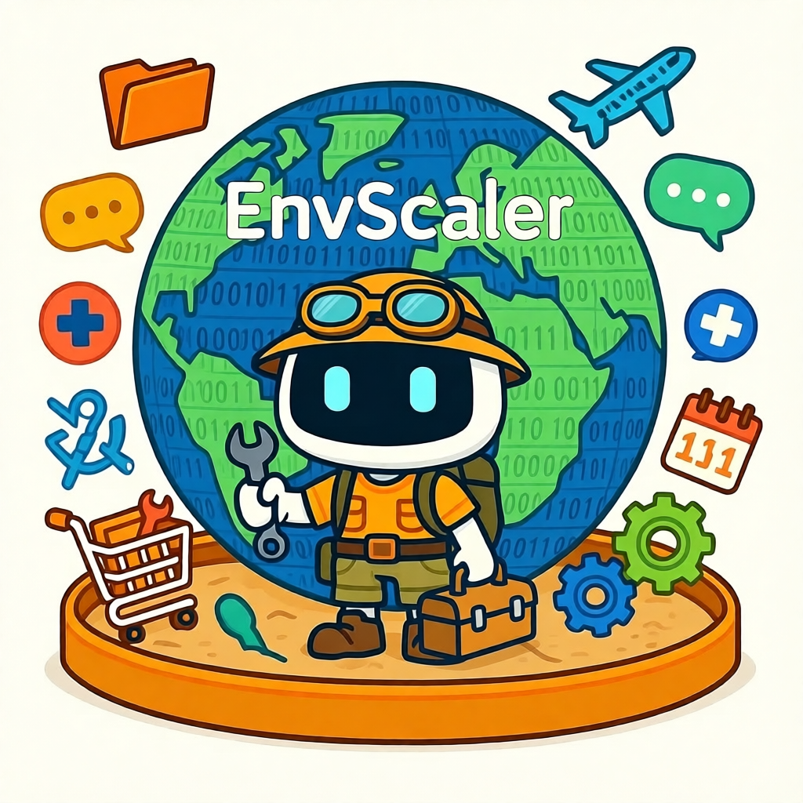
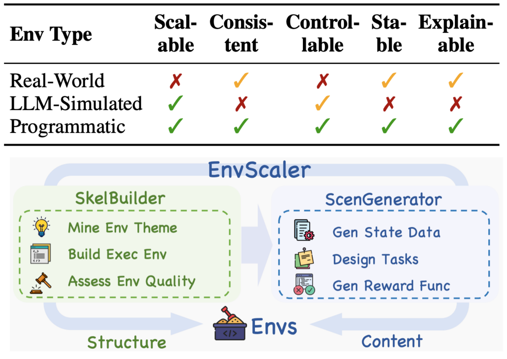
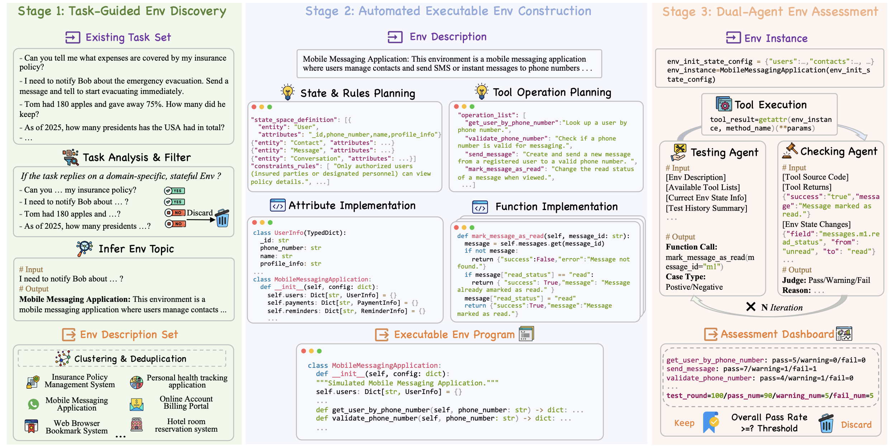
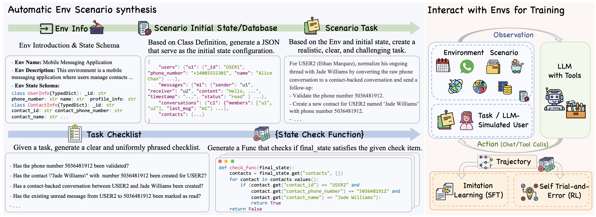
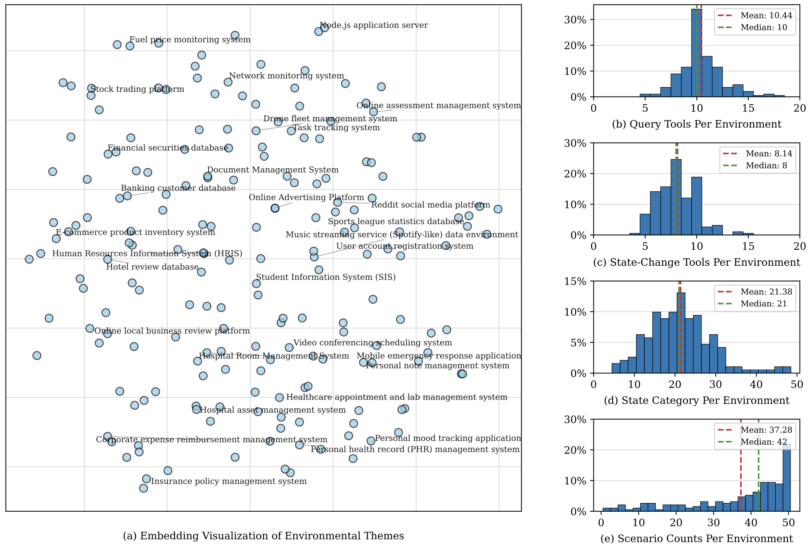
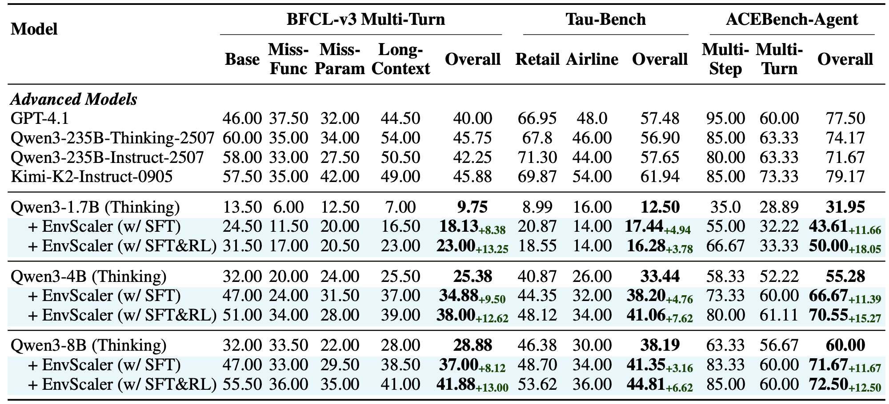

<div align="center">
  
</div>
<h1 align="center"> EnvScaler: Scaling Tool-Interactive Environments for LLM Agent via Programmatic Synthesis</a></h1>


<div align="center">
  <a href="https://arxiv.org/abs/2601.05808">
    
  </a>
  <a href="https://huggingface.co/collections/XXHStudyHard/envscaler">
    
  </a>
  <a href="https://huggingface.co/collections/XXHStudyHard/envscaler">
    
  </a>
  <a href="https://opensource.org/licenses/MIT">
    
  </a>
  <a href="https://www.python.org/downloads/release/python-312/">
    
  </a>
</div>

<div align="center">
  <a href="README_ZH.md">中文</a> | <a href="README.md">English</a>
</div>


<h5 align="center">如果您喜欢我们的项目，请在GitHub上给我们点个 ⭐。我们会非常感谢您的支持。</h5>

## 🎬 Demo

### Env-Agent-User Interaction
<div align="center">
    <video src="https://github.com/user-attachments/assets/613b46fd-63db-4050-91d2-f7aca2a766e3" />
</div>

### Env-Agent Interaction
<div align="center">
    <video src="https://github.com/user-attachments/assets/b8186257-a22d-4ec1-9ccf-82f6bd23a4b5" />
</div>

### Building Environment From Scratch
<div align="center">
    <video src="https://github.com/user-attachments/assets/fd947e46-014a-41cd-87bb-6744c3dd5b32" />
</div>

您可以本地运行与Env交互的demo:
```bash
cd interact_with_env
python app.py
```
您可以本地运行从零构建Env骨架的demo:
```bash
cd skel_builder
python env_build_demo.py
```

## 📦 Dataset & Models

我们提供EnvScaler的数据和模型 (SFT+RL) 如下:

| Data | Link |
| --- | --- |
| 191 Env Metadata | [🤗 HuggingFace](https://huggingface.co/datasets/XXHStudyHard/EnvScaler-191-Env) |
| 4.7K SFT Scenario | [🤗 HuggingFace](https://huggingface.co/datasets/XXHStudyHard/EnvScaler-SFT-Scenario) |
| 2.5K RL Scenario | [🤗 HuggingFace](https://huggingface.co/datasets/XXHStudyHard/EnvScaler-RL-Scenario) |
| 9K SFT Trajectory | [🤗 HuggingFace](https://huggingface.co/datasets/XXHStudyHard/EnvScaler-SFT-Traj-9K) |
|  |  |

| Model | Link |
| --- | --- |
| EnvScaler-Qwen3-1.7B | [🤗 HuggingFace](https://huggingface.co/XXHStudyHard/EnvScaler-Qwen3-1.7B) |
| EnvScaler-Qwen3-4B | [🤗 HuggingFace](https://huggingface.co/XXHStudyHard/EnvScaler-Qwen3-4B) |
| EnvScaler-Qwen3-8B | [🤗 HuggingFace](https://huggingface.co/XXHStudyHard/EnvScaler-Qwen3-8B) |
|  |  |

## 📑 Contents

- [🎬 Demo](#-demo)
- [📦 Dataset & Models](#-dataset--models)
- [👀 Overview](#-overview)
- [📊 Results](#-results)
- [📁 Project Structure](#-project-structure)
  - [skel_builder/ - 环境骨架构建](skel_builder/README_ZH.md)
  - [scen_generator/ - 场景生成](scen_generator/README_ZH.md)
  - [interact_with_env/ - Agent与环境交互](interact_with_env/README_ZH.md)
  - [sft/ - 监督微调](sft/README_ZH.md)
  - [rl/ - 强化学习](rl/README_ZH.md)
  - [evaluation/ - 评估指南](evaluation/README_ZH.md)
- [🚀 Quick Start](#-quick-start)
- [📚 Citation](#-citation)
- [📞 Contact](#-contact)


## 👀 Overview

**EnvScaler** 是一个自动化，可扩展的框架，通过程序实现可运行、带状态、支持工具交互的环境，用于训练LLM智能体。

<p align="center">
     <br>
  Overview of <b>EnvScaler</b>.
</p>

**SkelBuilder** 是 EnvScaler 的第一阶段。它 (1) 从现有的开源文本任务出发，挖掘潜在的领域描述; (2) 规划对应的状态模式与业务规则，并生成一个功能完整的 Python 类，其方法对外暴露工具接口; (3) 双智能体循环环境质检（一个随机发起工具调用，另一个检查代码、返回值及状态变化），保证质量与一致性。

<p align="center">
     <br>
  Framework of <b>SkelBuilder</b>.
</p>

**ScenGenerator** 是第二阶段。给定一个环境骨架，它首先提示LLMs生成初始状态/数据库，然后创建一个从该状态出发可解决的挑战性任务。最后，它将任务分解为若干独立检查点，并把每个检查点转换成针对环境最终状态的 Python 布尔函数，提供基于规则,可验证的奖励信号。
 
<p align="center">
     <br>
  Framework of <b>ScenGenerator</b>.
</p>

## 📊 Results

借助 EnvScaler，我们合成了 191 个环境、约 7 000 个场景，并将其应用于 Qwen3 系列模型的监督微调（SFT）与强化学习（RL）。在三个基准测试上的结果表明，EnvScaler 显著提升了大语言模型在涉及多轮、多工具交互的复杂环境中解决任务的能力。

<p align="center">
     <br>
  Statistics of 191 synthesized environments.
</p>

<p align="center">
     <br>
  Performance comparison.
</p>

## 📁 Project Structure

```
EnvScaler/
├── skel_builder/              # 阶段1: 环境骨架构建
├── scen_generator/            # 阶段2: 场景生成
├── interact_with_env/         # Agent与环境交互
├── sft/                       # 监督微调（SFT）
├── rl/                        # 强化学习（RL）
└── evaluation/                # 评估指南
```

### 模块说明

> 💡 **提示**: 我们分别在每个模块下提供了详细的实现文档。

1. **[skel_builder/](skel_builder/README_ZH.md)** - 环境骨架构建框架，从现有任务中自动生成可执行的环境类
2. **[scen_generator/](scen_generator/README_ZH.md)** - 场景生成框架，为环境骨架生成状态数据, 任务场景和检查函数
3. **[interact_with_env/](interact_with_env/README_ZH.md)** - Agent与环境交互模块，支持（1）与合成的环境交互来采集训练数据以及（2）基准评估
4. **[sft/](sft/README_ZH.md)** - 监督微调实现，基于LlamaFactory进行SFT训练
5. **[rl/](rl/README_ZH.md)** - 强化学习实现，基于ROLL框架进行RL训练
6. **[evaluation/](evaluation/README_ZH.md)** - 评估指南，包含BFCL、TauBench、ACEBench等评估


## 🚀 Quick Start

### 1. 克隆仓库

```bash
git clone https://github.com/RUC-NLPIR/EnvScaler
cd EnvScaler
```

### 2. 安装依赖

```bash
pip install -r requirements.txt
```

> 💡 **注意**: 本项目的基础依赖已包含在 `requirements.txt` 中。如果您需要进行 SFT 或 RL 训练，请参考对应的子项目文档安装额外依赖：
> - SFT训练: 参考 [sft/README_ZH.md](sft/README_ZH.md) 安装 LlamaFactory
> - RL训练: 参考 [rl/README_ZH.md](rl/README_ZH.md) 安装 ROLL 框架

### 3. 配置LLM服务


#### 方式1: 使用OpenAI API

在项目根目录创建 `.env` 文件，配置OpenAI API密钥：

```bash
# .env
OPENAI_API_KEY=your-openai-api-key-here
OPENAI_BASE_URL=https://api.openai.com/v1
```

#### 方式2: 使用自部署模型

您可以使用兼容OpenAI接口的推理框架例如 [vLLM](https://docs.vllm.ai/en/stable/serving/openai_compatible_server/) 部署本地模型。

**使用vLLM部署模型：**

```bash
vllm serve your-model-path \
    --host 0.0.0.0 \
    --port 8000 \
    --trust-remote-code
```

> ⚠️ **重要**: 确保部署的模型服务支持**函数调用（Function Calling, FC）接口**，，详情请参考 [vLLM OpenAI-Compatible Server文档](https://docs.vllm.ai/en/stable/serving/openai_compatible_server/)。

### 4. 验证配置

运行演示程序验证配置是否正确：

```bash
# 环境交互演示
cd interact_with_env
python app.py

# 环境交互Debug
cd interact_with_env
python run_main_debug.py

# 环境构建演示
cd skel_builder
python env_build_demo.py
```

### 5. 开始使用

现在您可以开始使用EnvScaler的各个模块了，每个模块在实现上互相独立:

- **构建环境**: 参考 [skel_builder/README_ZH.md](skel_builder/README_ZH.md)
- **生成场景**: 参考 [scen_generator/README_ZH.md](scen_generator/README_ZH.md)
- **采集训练数据**: 参考 [interact_with_env/README_ZH.md](interact_with_env/README_ZH.md)
- **模型训练**: 参考 [sft/README_ZH.md](sft/README_ZH.md) 和 [rl/README_ZH.md](rl/README_ZH.md)
- **评估**: 参考 [evaluation/README_ZH.md](evaluation/README_ZH.md)


## 📚 Citation

如果您觉得我们的工作对您有所帮助，请考虑引用。我们非常感谢您的支持。

```bibtex
@article{song2026envscaler,
  title={EnvScaler: Scaling Tool-Interactive Environments for LLM Agent via Programmatic Synthesis},
  author={Song, Xiaoshuai and Chang, Haofei and Dong, Guanting and Zhu, Yutao and Dou, Zhicheng and Wen, Ji-Rong},
  journal={arXiv preprint arXiv:2601.05808},
  year={2026}
}
```

## 📞 Contact

如有任何疑问或反馈，请通过[songxiaoshuai@ruc.edu.cn](songxiaoshuai@ruc.edu.cn) 联系我们。
