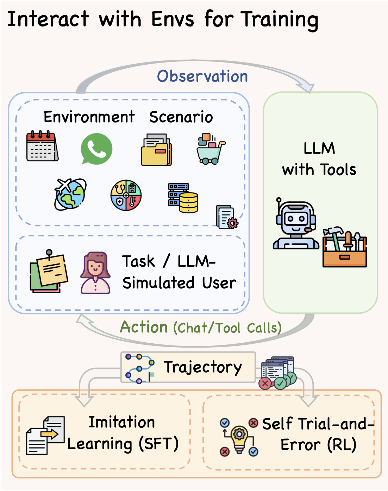

# Interact with Environment

<div align="left">
  <a href="README_ZH.md">中文</a> | <a href="README.md">English</a>
</div>

本项目实现Agent与Env的交互，主要用于：
1. **与EnvScaler合成环境交互**，获取用于训练的数据轨迹
2. **评估TauBench和AceBench等基准测试环境**的性能
3. **在RL训练中作为验证监控环境**

<p align="center">
     <br>
  Diagram of <b>Agent-Env Interaction</b>.
</p>


## 📁 目录结构

```
interact_with_env/
├── run_main.py              # 主程序：批量任务执行
├── run_main_debug.py        # 调试程序：单任务执行和调试
├── traj_filter.py           # SFT采集轨迹过滤脚本
├── calc_avg_score.py        # 计算平均奖励分数
├── agent/                   # Agent模块
│   ├── task_solve_agent.py      # LLM Agent逻辑实现
│   ├── agent_llm_inference.py   # LLM推理接口
│   └── system_prompt_util.py    # Agent系统提示词
├── envscaler_env/           # EnvScaler环境（训练用）
├── taubench_env/            # TauBench环境（评估用）
├── acebench_env/            # AceBench-Agent环境（评估用）
├── bfcl_env/                # BFCL Multi-Turn-Base环境（训练监控用）
├── result/                  # 结果输出目录
└── result_debug/            # 调试结果目录
```

## 🔄 Agent与Env交互流程

**Agent与环境的交互遵循类似[Gym](https://github.com/openai/gym)/[Gem](https://github.com/axon-rl/gem)的风格**，您可以轻松的迁移环境到符合Gym/Gem风格的训练框架上。
以下是抽象的交互流程：

```python
# 重置环境，获取Observation (任务信息或者用户对话)
observation, info = Env.reset(task_index=0)

max_step = 30
cur_step = 0
# 交互循环
while True:
    cur_step +=1
    # action: 工具调用或者与用户对话
    action = agent.step(observation)
    # observation: 工具执行结果或者用户回复
    observation, reward, terminated, truncated, info = Env.step(action)

    # 检查终止条件
    if terminated or truncated or cur_step > max_step: 
        break
```


执行任务后，结果会保存为JSON文件，包含以下字段：

```json
{
    "task_info": {
        // 任务相关信息（根据环境类型不同而不同）
    },
    "tools": [
        // 可用工具列表
    ],
    "messages": [
        // 完整的对话历史
    ],
    "user_messages": [
        // 用户消息（仅对话环境）
    ],
    "trajectory": [
        // 每一步的详细信息
        {
            "step": 0,
            "observation": {...},
            "action": {...},
            "reward": 0.0,
            "terminated": false,
            "truncated": false
        }
    ],
    "total_reward": 0.0,
    "terminated": false,
    "truncated": false,
    "final_observation": {...},
    "final_info": {...},
    "steps": 10
}
```

## 🔧 支持的环境

### 1. EnvScaler训练环境
```python
# EnvScaler非对话RL环境
env_name = "envscaler_non_conversation_rl"
env_config = {...}

# EnvScaler对话RL环境
env_name = "envscaler_conversation_rl"
env_config = {...}

# EnvScaler非对话SFT环境
env_name = "envscaler_non_conversation_sft"
env_config = {...}

# EnvScaler对话SFT环境
env_name = "envscaler_conversation_sft"
env_config = {...}
```
- 我们使用`envscaler_non_conversation_sft`与`envscaler_non_conversation_sft`用于SFT训练轨迹采集。
- 我们迁移`envscaler_non_conversation_rl`与`envscaler_non_conversation_rl`到ROLL框架用于RL训练。

### 2. TauBench评估环境
```python
# TauBench零售环境
env_name = "tau_bench_retail"
env_config = {...}

# TauBench航空环境
env_name = "tau_bench_airline"
env_config = {...}
```
- 我们使用`tau_bench_retail`与`tau_bench_airline`环境用于论文中的实验评估。
- 我们重新编排[TauBench](https://github.com/sierra-research/tau-bench)的官方代码, 并尽力保留原始的实现逻辑。


### 3. AceBench-Agent评估环境
```python
# AceBench多步骤环境
env_name = "acebench_multi_step"
env_config = {...}

# AceBench-Agent评估环境
env_name = "acebench_multi_turn"
env_config = {...}
```
- 我们使用`acebench_multi_step`与`acebench_multi_turn`环境用于论文中的实验评估。
- 我们重新编排[AceBench](https://github.com/chenchen0103/ACEBench)的官方代码, 并尽力保留原始的实现逻辑。
- 值得注意的是, ACEBench 使用 `[func_name(param)]`prompt格式; 我们修改了官方代码以支持 LLM 的原生函数调用接口 (FC)，以确保一致性。

### 4. BFCL验证环境
```python
env_name = "bfcl"
env_config = {"mode": "multi_turn_base", ...}
```
- 我们使用`bfcl (multi_turn_base)`环境用于RL训练过程中的验证监控。
- 对于论文中的实验评估，我们使用[BFCL](https://github.com/ShishirPatil/gorilla/tree/main/berkeley-function-call-leaderboard)官方的代码`(base, miss-param, miss-func, long-context)`。


## 🚀 快速开始

```bash
# 所有脚本使用相对路径，需要从 `interact_with_env` 目录运行
cd interact_with_env
```

**运行主程序:**

```bash
# 用于批量处理多个任务，支持多线程并行执行
python run_main.py
```
您需要在`run_main.py`中修改以下配置：

```python
# 1. 智能体模型配置
agent_model = "gpt-4.1"           # 使用的模型名称
agent_model_provider = "openai"        # 模型提供商
enable_thinking = True                 # 是否启用思考模式
num_workers = 3                        # 并行工作线程数

# 2. 环境配置
env_name = "selected_env_name"
infer_mode = "fc"                  # "prompt" 或 "fc"
env_config = {...} 
task_ids = [i for i in range(...)]   # 任务ID列表
```

**Debug模式:**
```bash
# 用于单个环境任务调试：
python run_main_debug.py
```

---

## 许可证

本项目属于 EnvScaler 项目的一部分。
